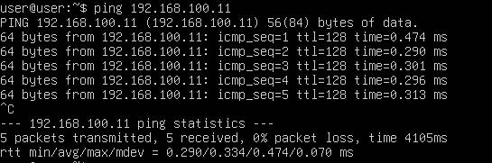
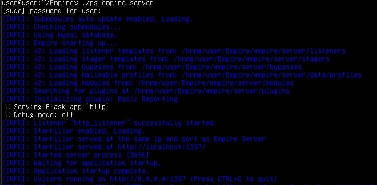
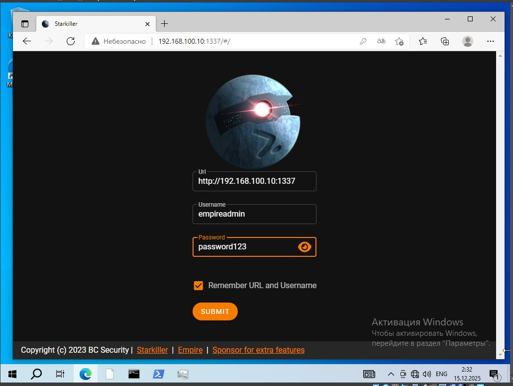
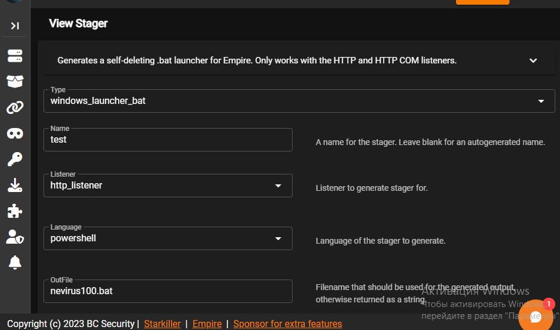
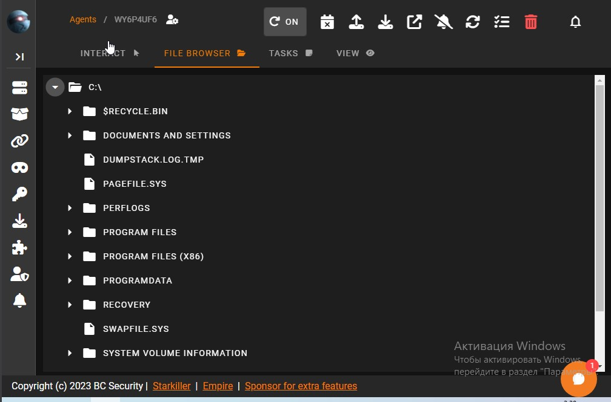
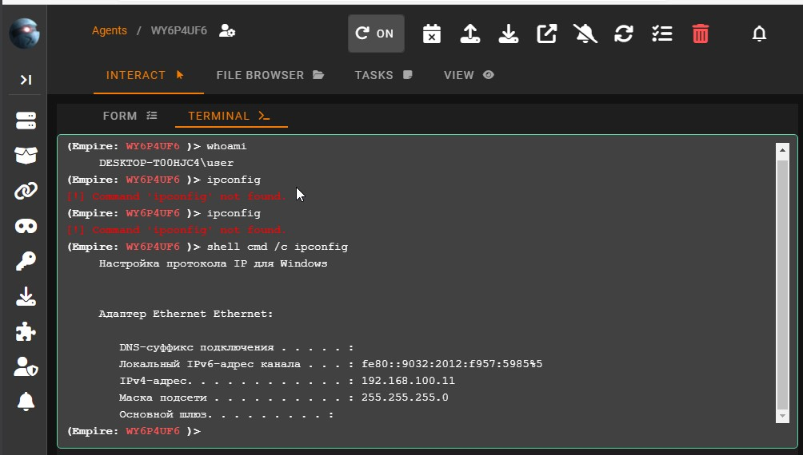

# Лабораторная работа №4
Работа выполнена ячейкой из трех человек: Ваюкин Михаил, Матушкин Павел, Шишков Артем

**Лабораторная работа:** Исследование Command & Control (C2) фреймворков

**Цель**: Развернуть современный C2-фреймворк, сгенерировать полезную нагрузку, установить удалённый контроль над машиной-жертвой и изучить принципы post-exploitation.


## Выбор фреймворка

Рассмотрены три современных C2-фреймворка:

| Фреймворк | Язык | Особенности | Сложность |
|-----------|------|-------------|----------|
| **[Havoc C2](https://github.com/kunpen/Havoc-C2)** | Go + C/ASM | Sleep obfuscation, Indirect Syscalls, Ekko, FOLIAGE | Сложная сборка (требует Qt, Python 3.10) |
| **[Adaptix C2](https://github.com/Adaptix-Framework/AdaptixC2)** | Go + C++/Qt | Кросс-платформенный GUI, гибкая архитектура через плагины | Требует ручной настройки |
| **[Empire](https://github.com/BC-SECURITY/Empire)** | Python 3 + PowerShell/C#/Go | 400+ модулей, встроенный GUI (Starkiller), Docker, MITRE ATT&CK | Простая установка, отличная документация |

**Выбран Empire** — как наиболее подходящий для обучения и лабораторных работ.


## Этап 1: Установка Empire на Ubuntu Server

### Требования

- Ubuntu Server 22.04/24.04
- Начиная с Empire 6.0, минимальной требуемой версией Python является Python 3.13, поэтому была использована версия Python 3.13.0
- `poetry`, `git`, `build-essential`

### Установка
```
git clone --recursive https://github.com/BC-SECURITY/Empire.git
cd Empire
./setup/checkout-latest-tag.sh  # переключение на стабильный релиз
./ps-empire install -y
```

## Этап 2: Сетевая настройка
Обе виртуальные машины настроены в режиме **Внутренняя сеть**  
Назначены статические ip-адреса:
- Ubuntu (C2-сервер): 192.168.100.10
- Windows (жертва): 192.168.100.11    


Для проверки пропингуем системы   


## Этап 3: Запуск сервера Empire и доступ через Starkiller
Находясь в Директории Empire прописываем
```
export EMPIRE_LISTEN_HOST=0.0.0.0   
export EMPIRE_LISTEN_PORT=1337   
./ps-empire server
```
Если все выполено верно будет выведено следующее:  
  

После этого на машине жертвы в браузере вводим в адресную строку http://192.168.100.10:1337 и получаем доступ к Starkiller  
  
Вводим логин и пароль, их можно найти на сервере в файле config.yaml, он формируется после первого запуска сервера
```
cd Empire/empire/server
nano config.yaml
```

## Этап 4 Генерация полезной нагрузки и доставка до жертвы

В Starkiller создаем HTTP Listener заполняем данные  
      


После генерируем stager типа launcher_bat выбираем созданный нами listener   
    

После чего скачиваем файл на машину жертвы и запускаем, на сайте покажется новый агент. **Важно:** на компьютере жертве должен быть отключен Windows Defender  
  


Мы получили удаленный доступ к машине жертвы, можем просматривать дериктории выолнять команды в cmd  
  
  

## Принципы работы C2-фреймворка
Empire реализует современную C2-архитектуру:

- Listener — ожидает подключения агентов (HTTP/S, SMB и др.).
- Payload — генерируется на сервере, содержит зашифрованный beacon.
- Agent — выполняется в памяти (fileless), использует advanced obfuscation (ConfuserEx, Invoke-Obfuscation).
- Коммуникация — полностью шифруется, имитирует легитимный трафик (JA3/S и JARM evasion).
- Управление — через Starkiller GUI с поддержкой нескольких операторов.
